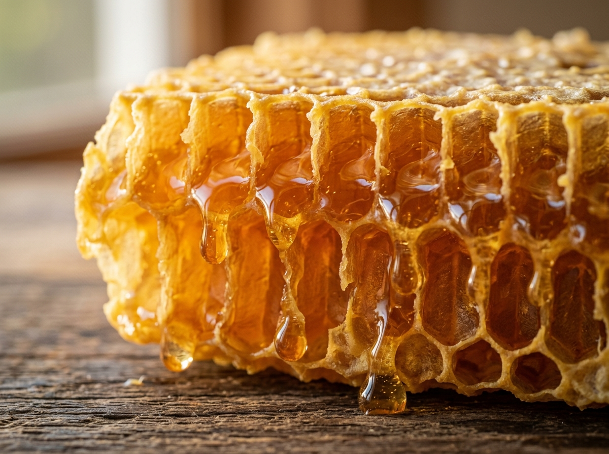

# Amber & Oak — Multipurpose Natural Honey & Natural Sweetener Store HTML Template



**Amber & Oak** is a premium, multipurpose HTML5/CSS3/JavaScript website and administrative template tailored for artisanal beekeepers, single-origin raw honey retailers, natural organic sweetener purveyors, and commercial apiculture services.

Crafted to the highest commercial standards for platforms like **ThemeForest**, **TemplateMonster**, or direct high-end client deliverables, this template provides a complete customer storefront, an interactive user account portal, and a powerful executive admin dashboard.

---

## 🍯 Key Highlights & Features

- **Full Multipurpose Architecture**:
  - **Home Page 1**: Warm, organic layout showcasing raw honey sourcing narrative, interactive 4-step harvesting timeline, featured harvests, health spotlight, and verified customer testimonials.
  - **Home Page 2**: Commercial B2B landing for orchard pollination contracts, private label co-packing, foodservice bulk supply, and apiary stewardship.
  - **Products Catalog**: Multi-variety filtering (Wildflower, Forest Honeydew, Certified Organic, Raw Honeycomb, Natural Plant Sweeteners), real-time search, price range slider, and sort controls.
  - **Product Showcase**: Detailed pages with batch lab spectrometry analysis certificates (Moisture, Diastase DN, HMF, C4 sugar tests), nutritional facts, jar size selector, and reviews.
  - **Health Benefits Hub**: Deep dive into apitherapy biochemistry, comparing raw unheated honey vs. processed commercial syrups, plus Glycemic Index (GI) breakdowns.
  - **Bulk & Gifting Suite**: Bespoke corporate gift boxes, wedding favor favors, and an **interactive live volume discount calculator** (10% to 30% savings).
  - **Services & Booking**: Detailed service pages with pricing tables, FAQs accordion, and reservation inquiry forms.
  - **Journal / Blog**: Filterable articles, rich editorial typography, author bio, reader comments, and sidebar widgets.
  - **Full Cart & Checkout Flow**: Reactive basket with coupon code application (`HONEY10`, `RAW20`), shipping estimator, multi-step checkout, and slide-over mini-cart drawer.
  - **Utility Pages**: Pricing tiers, dual Login/Register with demo accounts, 404 Error page, and a Coming Soon page with active JavaScript countdown timer.
- **Customer User Dashboard (`user-dashboard/`)**:
  - Account Overview with gold tier badge & loyalty points counter.
  - Order History with shipment tracking stepper & PDF invoice downloads.
  - Saved Favorites Wishlist with instant "Move to Basket" action.
  - Address Book with default shipping badges and modal form.
  - Notification and dietary sweetener preferences.
- **Store Operations Admin Dashboard (`admin-dashboard/`)**:
  - Executive analytics powered by **Chart.js** (Revenue trend line chart, variety sales doughnut chart).
  - Product inventory table with stock indicators and "Add New Product" modal.
  - Order fulfillment pipeline with status filters (Pending, Processing, Shipped, Delivered).
  - Customer directory with lifetime spend metrics and loyalty tiers.
  - Honey varieties and category manager.
  - Store settings, shipping rules, tax rates, and payment gateway toggles.
- **Theme & Internationalization**:
  - **Dark & Light Mode**: Instant toggle with smooth transitions and `localStorage` persistence.
  - **RTL (Right-to-Left) Ready**: 100% bidirectional support for Arabic and Hebrew layouts.
- **Pure Zero-Build Technology**:
  - Vanilla JavaScript ES6+ modules with zero build step (webpack/vite/gulp) required.
  - Works straight out of the box by opening `index.html` in any modern browser!

---

## 📁 File & Directory Structure

```text
natural-honey-store/
│
├── index.html                   # Home 1: Raw Honey Store & Sourcing Story
├── home-2.html                  # Home 2: B2B Apiculture & Commercial Services
├── about.html                   # About Us: Heritage, Master Beekeeper, Certifications
├── products.html                # Products Catalog by Variety (Filterable & Searchable)
├── product-details.html         # In-Depth Product Details, Lab Tests, Specs & Reviews
├── health-benefits.html         # Health Science, Raw vs Processed Honey Comparison
├── bulk-gifting.html            # Corporate Hampers, Wedding Favors & Live Calculator
├── services.html                # Apiculture Services Grid & Offerings
├── service-details.html         # Service Breakdown, Pricing Table, FAQs & Booking
├── blog.html                    # Journal & Recipe Articles List
├── blog-details.html            # Single Article with Sidebar, Bio & Comments
├── contact.html                 # Contact Info, Farm Location Map & Enquiry Form
├── cart.html                    # Shopping Cart with Promo Codes & Shipping
├── checkout.html                # Multi-Step Checkout Simulation & Order Summary
├── pricing.html                 # Pantry Subscriptions & Wholesale Pricing Tiers
├── login.html                   # Customer Login & Registration Tabbed Interface
├── 404.html                     # Honey-Themed 404 Page ("Hive is Empty")
├── coming-soon.html             # Launch Countdown Timer & Email Notify Form
│
├── assets/
│   ├── images/
│   │   ├── logo/                # SVG & PNG brand emblems
│   │   ├── hero/                # High-resolution honey hero imagery
│   │   ├── products/            # Wildflower, forest, organic, honeycomb, syrups
│   │   ├── sourcing/            # Beekeepers, mountain hives, honey extraction
│   │   ├── gifting/             # Corporate hamper boxes, wedding favor jars
│   │   ├── testimonials/        # Customer and master apiarist avatars
│   │   └── icons/               # Honeycomb, organic leaf, nectar drop SVGs
│   └── fonts/                   # Web font assets
│
├── css/
│   ├── style.css                # Master stylesheet with design tokens & components
│   ├── responsive.css           # Mobile-first breakpoints and offcanvas drawers
│   ├── rtl.css                  # Right-to-Left styling for Arabic/Hebrew
│   ├── dashboard.css            # Customer User Portal styles
│   └── admin.css                # Admin Dashboard layout, charts, and tables
│
├── js/
│   ├── main.js                  # Global UI initialization, sticky header, countdown
│   ├── theme.js                 # Dark / Light mode toggle with localStorage
│   ├── rtl.js                   # RTL / LTR layout toggle with localStorage
│   ├── products.js              # Catalog renderer, search, price slider, categories
│   ├── cart.js                  # Reactive cart state, drawer, and price calculation
│   ├── wishlist.js              # Customer favorites management and badge sync
│   ├── forms.js                 # Form validations, toast notifications, bulk calculator
│   └── storage.js               # Centralized localStorage helper and state bus
│
├── user-dashboard/
│   ├── index.html               # Account Overview & active shipment tracking
│   ├── profile.html             # Profile identity & password settings
│   ├── orders.html              # Full order history & invoice modal
│   ├── wishlist.html            # Customer favorited jars & quick add to cart
│   ├── addresses.html           # Saved shipping addresses & modal
│   └── settings.html            # Communication alerts & dietary preferences
│
├── admin-dashboard/
│   ├── index.html               # Executive analytics, Chart.js graphs, recent orders
│   ├── products.html            # Inventory management with "Add Product" modal
│   ├── orders.html              # Orders fulfillment pipeline with status updates
│   ├── customers.html           # Customer CRM directory & loyalty tiers
│   ├── categories.html          # Honey varieties & taxonomies manager
│   └── settings.html            # Store profile, logistics, and payment gateways
│
├── data/
│   ├── products.json            # JSON catalog database with origins, tasting notes, prices
│   ├── users.json               # Customer profiles and address databases
│   └── orders.json              # Transaction history and parcel shipment manifests
│
└── README.md                    # Template documentation and developer manual
```

---

## 🚀 Getting Started & Installation

### Option 1: Direct File Opening
Double-click `index.html` to open it directly in Google Chrome, Mozilla Firefox, Apple Safari, or Microsoft Edge. All scripts, fonts, and local assets will function seamlessly.

### Option 2: Local HTTP Server (Recommended)
Running through a local web server allows full asynchronous fetching of `data/*.json`:
```bash
# Using Node.js npx serve
npx serve .

# Using Python 3
python -m http.server 8000

# Using PHP
php -S localhost:8000
```
Open your browser and navigate to `http://localhost:8000`.

---

## 🎨 Customization Guide

### 1. Modifying Color Palette & Branding
All colors are centralized in `css/style.css` using standard CSS Custom Properties:
```css
:root {
  /* Change Brand Honey Accent */
  --honey-500: #F59E0B;
  --honey-600: #D97706; /* Primary brand amber */
  --honey-700: #B45309;

  /* Change Botanical Earth Accent */
  --forest-800: #166534; /* Rich forest green */

  /* Change Background Tones */
  --body-bg: #FCF9F2;    /* Warm cream surface */
  --surface-card: #FFFFFF;
}
```

### 2. Changing Typography
The template links to Google Fonts (*Playfair Display* for regal headings, *Plus Jakarta Sans* for clean interface typography). To change fonts:
1. Update font link in `<head>`:
   ```html
   <link href="https://fonts.googleapis.com/css2?family=Cinzel:wght@700&family=Inter:wght@400;600&display=swap" rel="stylesheet">
   ```
2. Update CSS variables in `css/style.css`:
   ```css
   :root {
     --font-heading: 'Cinzel', serif;
     --font-body: 'Inter', sans-serif;
   }
   ```

### 3. Adding New Honey Products
Add a new item to `data/products.json` or to the fallback array in `js/products.js`:
```json
{
  "id": "prod-9",
  "name": "Lavender Blossom Honey",
  "category": "wildflower",
  "categoryName": "Wildflower Honey",
  "price": 27.00,
  "rating": 4.9,
  "image": "assets/images/products/wildflower-honey.jpg",
  "origin": "Valensole Plateau, France",
  "tastingNotes": ["Lavender", "Floral Perfume", "Sweet Cream"],
  "sizes": ["250g", "500g"]
}
```

### 4. Setting Default Theme or RTL Layout
- **Dark Mode by default**: Add `data-theme="dark"` and `data-bs-theme="dark"` to the `<html>` tag.
- **RTL by default**: Add `dir="rtl"` to `<html>` and remove the `disabled` attribute from `<link id="rtl-stylesheet" href="css/rtl.css">`.

---

## 🛒 Interactive Modules & Developer API

### Shopping Basket (`CartController`)
The cart state persists across page transitions via `localStorage`:
```javascript
// Add an item to the basket
CartController.addItem({
  id: 'prod-1',
  name: 'Wild Alpine Meadow Honey',
  price: 24.50,
  image: 'assets/images/products/wildflower-honey.jpg'
}, 1, '500g');

// Retrieve active basket totals
const totals = CartController.getTotals();
console.log(totals.total, totals.subtotal, totals.discount);

// Apply a promo discount voucher
CartController.applyCoupon('HONEY10'); // 10% off
```

### Wishlist (`WishlistController`)
```javascript
// Toggle product favorite status
WishlistController.toggle('prod-1');

// Check if an item is saved
if (WishlistController.has('prod-1')) { ... }
```

### Toast Notifications (`FormsHelper`)
```javascript
// Trigger a floating honey toast notification
FormsHelper.showToast('Your jar has been added to the basket!', 'success');
FormsHelper.showToast('Invalid promo code entered.', 'error');
```

---

## 🌐 Browser Compatibility & Standards

- **Google Chrome**: 90+
- **Mozilla Firefox**: 88+
- **Apple Safari**: 14+
- **Microsoft Edge**: 90+
- **Mobile Safari & Chrome**: iOS 14+, Android 10+
- **Accessibility**: Semantic HTML5 elements, ARIA labels on icon buttons, contrast-tested typography.

---

## 📜 Credits & Third-Party Assets

- **Framework**: Bootstrap 5.3.3 (MIT License)
- **Icons**: Font Awesome 6 Free (CC BY 4.0 / SIL OFL)
- **Fonts**: Google Fonts (Playfair Display, Plus Jakarta Sans) (SIL OFL)
- **Charts**: Chart.js 4.4 (MIT License)
- **Photography**: Royalty-free curated artisanal photography via Unsplash

---

&copy; 2026 **Amber & Oak Honey Co.** Designed for ThemeForest & TemplateMonster. All rights reserved.
